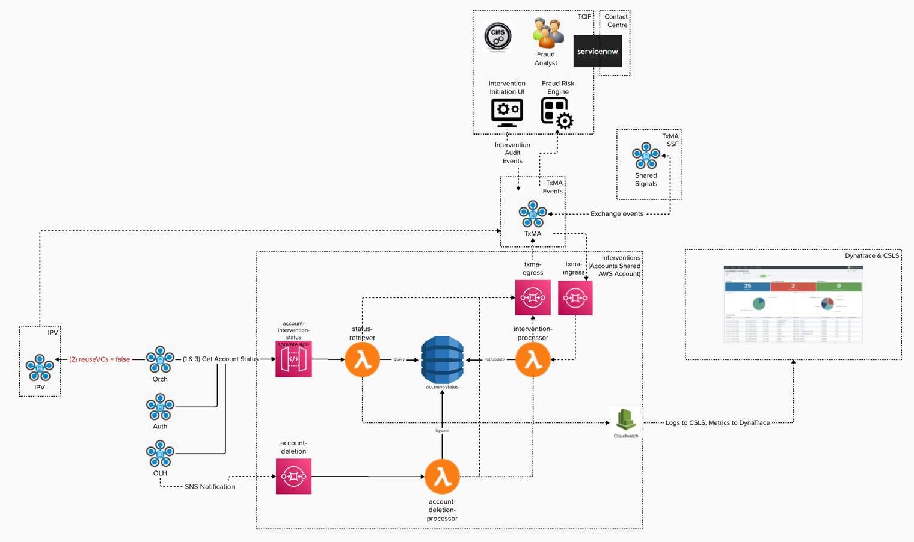

# Account Interventions Service
[](https://github.com/govuk-one-login/account-interventions-service/actions/workflows/acceptance-checks.yaml)
[](https://sonarcloud.io/summary/new_code?id=govuk-one-login_account-interventions-service)
[](https://github.com/govuk-one-login/account-interventions-service/actions/workflows/merge-main-to-main.yaml)

## Introduction
A serverless typescript project for the Account Intervention Service solution.

## How To
### Prerequisites
- [Docker](https://docs.docker.com/engine/install/) >= v20.10
- [SAM CLI](https://docs.aws.amazon.com/serverless-application-model/latest/developerguide/install-sam-cli.html#install-sam-cli-instructions) >= 1.96.0

### Clone the repo
```shell
git clone git@github.com:govuk-one-login/account-interventions-service.git
cd account-interventions-service
```

### Setup Pre-Commit
```shell
$ pre-commit install -f
$ yarn husky install
```

### Install Project Dependencies
``` bash
$ yarn install
```

###  Test Project
To fully test the application, try the test command below
``` bash
$ yarn test
```

### Build & deploy **main** application manually stack for development
To build the application code and deploy the ais-main stack use the following commands **from project root directory**.
Make sure NOT to pass a --template / -t flag to the `sam deploy` command. By simply running `sam deploy --guided` SAM will pick up the relevant version of the main template from the default directory `.aws-sam/build` which is created during the build process
Ensure you have logged into AWS and obtained credentials before attempting to deploy manually
``` bash
$ yarn package
$ sam deploy --guided
```

### Deploy **alarm** stack manually for development
To manually deploy the ais-alarm stack, use the following commands **from project root directory**.
Ensure you have logged into AWS and obtained credentials before attempting to deploy manually.

``` bash
$ sam deploy --guided -t src/infra/alarm/template.yaml
```

### Deploy **core** stack manually for development
To manually deploy the ais-core stack, use the following commands **from project root directory**.
Ensure you have logged into AWS and obtained credentials before attempting to deploy manually.
``` bash
$ sam deploy --guided -t src/infra/core/template.yaml
```

### Lints Code, SAM Template & Open API Spec
``` bash
$ yarn lint
```
- `yarn lint:code` - TypeScript is linted by [ESLint](.eslintrc.js)
- `yarn lint:iac` - SAM template is linted by [SAM CLI](https://docs.aws.amazon.com/serverless-application-model/latest/developerguide/validate-cfn-lint.html)
- `yarn lint:spec:oas` - OpenAPI specification is linted by [Spectral](https://docs.aws.amazon.com/serverless-application-model/latest/developerguide/validate-cfn-lint.html)

#### Fix ES Lint Issues
```shell
$ yarn lint:code:fix
```

### Check For Vulnerable Dependencies
```shell
$ yarn audit
```
#### Fix Vulnerable Dependencies
```shell
$ yarn audit:fix
```

## Architecture Diagram


## How To Deploy
### 1. Setup Base CloudFormation Stacks
To deploy the base common CloudFormation stacks required created by Dev Platform prior to deploying the solution use the Stack Orchestation tool provided in our [stack-orchestration](stack-orchestration) directory and run the [production_bootstrap.sh](stack-orchestration%2Fproduction_bootstrap.sh) script.

***The stacks to be deployed are:***
1. alerting-integration
2. api-gateway-logs
3. certificate-expiry
4. vpc
5. lambda-audit-hook
6. checkov-hook
7. infra-audit-hook

### Setup AWS SSO Login
```shell
$ aws configure sso
```
- Choose session name: _{enter your name}_
- Accept authorisation in browser
- Choose the AWS account in the dropdown
- CLI default client Region: eu-west-2
- CLI default output format: json
- aws sso login --profile _{profile name provided for account}

#### Stack Orchestation Tool Prerequisites

- [aws-vault](https://github.com/99designs/aws-vault)
- [jq](https://formulae.brew.sh/formula/jq)

#### ⚡ Prior to deploying check the latest versions of these stacks are being referenced which can be found here > [CHANGELOG](https://github.com/govuk-one-login/devplatform-deploy/tree/main)

#### Steps:

```shell
$ cd stack-orchestation
$ aws configure sso
$ aws sso login --profile di-account-intervention-admin-324281879537
$ sh production_bootstrap.sh
```
The bootstrap script should deploy all base Cloudformation stacks required for account set up.

### 2. Deploy ais-infra stacks
#### Clone the [ais-infra](https://github.com/govuk-one-login/ais-infra/blob/3046cb392b657ded2b652a52f0652a6ccd4d8630/) repo
```shell
git clone git@github.com:govuk-one-login/ais-infra.git
cd ais-infra
```
##### ⚠️ Setup pre-commit
```shell
$ pre-commit install -f
```

#### Deploy the following stacks in the following order:
1. `ais-infra-alerting` - [README.md](https://github.com/govuk-one-login/ais-infra/blob/0087789dc22a0abede2458a67106f7e45dff2b99/ais-infra-alerting/README.md)
2. `ais-infra-common` - [README.md](https://github.com/govuk-one-login/ais-infra/blob/c3ce026093e69cbfdf4272b119a1fe8cb31ee4cf/ais-infra-common/README.md)
3. `ais-dynatrace-metrics` - [README.md](https://github.com/govuk-one-login/ais-infra/blob/c3ce026093e69cbfdf4272b119a1fe8cb31ee4cf/ais-dynatrace-metrics/README.md)

### 3. Setup secure pipelines

These pipelines should deploy the main solution stacks

1. `ais-core-pipeline` deploy our `ais-core` stack
2. `ais-main-pipeline` deploys our `ais-main` stack
3. `ais-alarm-pipeline` deploys our `ais-alarm` stack

#### Setup these 3 secure pipelines by using the Stack Orchestation tool provided in our [Stack-Orchestration](stack-orchestration) directory and run the [production_pipelines.sh](stack-orchestration%2Fproduction_pipelines.sh) script.

#### ⚡ Prior to deploying check the latest version of secure pipelines is being referenced in the [production_pipelines.sh](stack-orchestration%2Fproduction_pipelines.sh) script >  [**CHANGELOG**](https://github.com/govuk-one-login/devplatform-deploy/blob/main/sam-deploy-pipeline/CHANGELOG.md#added-32)

#### Deployment Steps:

```shell
$ cd stack-orchestation
$ aws configure sso
$ aws sso login --profile di-account-intervention-admin-324281879537
$ sh production_pipelines.sh
```

Once all production pipelines have been set up, proceed to running the [staging_pipelines.sh](stack-orchestration%2Fstaging_pipelines.sh) script to allow promotion up to `production` account.

```shell
$ cd stack-orchestation
$ aws configure sso
$ aws sso login --profile di-id-reuse-core-staging-admin-922902741880
$ sh staging_pipelines.sh
```

## Stack Deployment Versions

❗ **Update this table if version has been updated**

|             | ais-main-pipeline | ais-core-pipeline | ais-alarm-pipeline | alerting-integration | api-gateway-logs | certificate-expiry | vpc    | ecr-image-scan-findings-logger | lambda-audit-hook |  checkov-hook | infra-audit-hook |
|-------------|-------------------|-------------------|--------------------|----------------------|------------------|--------------------|--------|--------------------------------|-------------------|---------------|------------------|
| Dev         | v2.45.4           | v2.45.4           | v2.45.4            | v1.0.6               | v1.0.5           | v1.1.0             | v2.3.1 | v.1.1.4                        | n/a               | n/a           | n/a              |
| Build       | v2.45.4           | v2.45.4           | v2.45.4            | v1.0.6               | v1.0.5           | v1.1.0             | v2.3.1 | v.1.1.4                        | n/a               | n/a           | n/a              |
| Staging     | v2.45.4           | v2.45.4           | v2.45.4            | v1.0.6               | v1.0.5           | v1.1.0             | v2.3.1 | v.1.1.4                        | n/a               | n/a           | n/a              |
| Integration | v2.45.4           | v2.45.4           | v2.45.4            | v1.0.6               | v1.0.5           | v1.1.0             | v2.3.1 | v.1.1.4                        | n/a               | n/a           | n/a              |
| Production  | v2.45.4           | v2.45.4           | v2.45.4            | v1.0.6               | v1.0.5           | v1.1.0             | v2.3.1 | n/a                            | n/a               | n/a           | n/a              |


## Additional Info

### Old SAM version
If you already have an earlier version of SAM installed you may need to either upgrade SAM or uninstall it
and reinstall it.
Here are some instructions you can follow to do this:
```shell
$ brew upgrade aws-sam-cli
```
[Managing AWS SAM CLI versions - AWS Serverless Application Model](https://docs.aws.amazon.com/serverless-application-model/latest/developerguide/manage-sam-cli-versions.html)

### Pre-commit

The command may be required if you do not already have pre-commit installed on your machine
```shell
$ brew install pre-commit
```

### Using nodenv
If you work across multiple Node.js projects there's a good chance they require different Node.js and npm versions.

To enable this we use [nodenv](https://github.com/nodenv/nodenv#readme) to switch between versions automatically.

1. Install and setup [nodenv](https://github.com/nodenv/nodenv#installation).
2. Install the NodeJS version used by this project `nodenv install <node-version>`.

```shell
$ brew install nodenv
$ nodenv init
$ cat .node-version | nodenv install
```

Getting latest releases of Node Version supported by nodenv (this may take a while)
```shell
brew upgrade nodenv node-build
```

### Testing the Private Api Gateway endpoint
The api in this application is a private api, which means testing it can't be done using tools like postman. The lambda `{stack-name}-InvokePrivateAPIGatewayFunction` has been created to allow the api to be tested. Since this lambda is created within the application's VPC, it meets the required security measures so it is able to successfully invoke the endpoint.

The api has the following format:
```
<baseurl>/ais/:userId?history=true
```
Note: the query string parameter (`history=true`) is optional.

This lambda sets default values for the baseUrl and the endpoint (e.g. `ais`) in the environment variables.

There are two ways to use this lambda:

### :calendar: Using the lambda event:
All of these keys are optional. Anything provided in the event will override the default value in the environment variable.
```
{
    "userId": "<theUserId>",
    "queryParameters": "history=true",
    "baseUrl": "<theBaseUrl eg http://hello-world.com>",
    "endpoint": "<theEndpoint eg /ais>",
    "headers": { 'Content-Type': 'application/json' } // add any headers here
}
```

### :seedling: Using the environment variables:
Update the values for these variables. Note, if you also provide the equivalent value in the lambda event, the lambda will use the lambda event values.
```
USER_ID
QUERY_PARAMETERS
BASE_URL
END_POINT
```

Note: that at the moment the lambda is not set up to work for a post request, so changes to the lambda will need to be made if post requests become a requirement.
