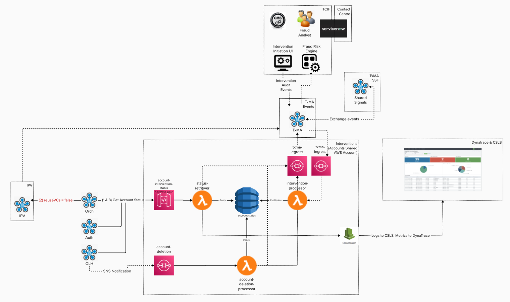

# Account Interventions Service

[](https://github.com/govuk-one-login/account-interventions-service/actions/workflows/acceptance-checks.yaml)
[](https://sonarcloud.io/summary/new_code?id=govuk-one-login_account-interventions-service)
[](https://github.com/govuk-one-login/account-interventions-service/actions/workflows/merge-main-to-main.yaml)

## Introduction

A serverless typescript project for the Account Intervention Service solution.

## How To

### Prerequisites

- [Docker](https://docs.docker.com/engine/install/) >= v20.10
- [SAM CLI](https://docs.aws.amazon.com/serverless-application-model/latest/developerguide/install-sam-cli.html#install-sam-cli-instructions) >= 1.138.0

### Clone the repo

```shell
git clone git@github.com:govuk-one-login/account-interventions-service.git
cd account-interventions-service
```

### Setup Pre-Commit

```shell
pre-commit install -f
```

### Setup access to private repositories

In order to install private packages, such as @govuk-one-login/event-catalog, an npmrc file is required. This `~/.npmrc` file must contain a Personal Access Token (PAT) with `read:packages` permissions in the following format:

```text
@govuk-one-login:registry=https://npm.pkg.github.com
//npm.pkg.github.com/:_authToken=<generated-token>
```

For guidance on generating a PAT, refer to the documentation: [Configuring Node package managers](https://team-manual.account.gov.uk/development-standards-processes/coding-practices-and-processes/configure-node-package-managers/#enabling-ignore-scripts-for-your-user) and [Managing Your Personal Access Tokens](https://docs.github.com/en/authentication/keeping-your-account-and-data-secure/managing-your-personal-access-tokens).

### Install Project Dependencies

```bash
$ npm install
```

### Test Project

To fully test the application, try the test command below

```bash
$ npm test
```

### Run mutation tests

We have [Stryker](https://stryker-mutator.io/) installed on the project for [mutation testing](https://en.wikipedia.org/wiki/Mutation_testing). You can run Stryker via npm script:

```sh
npm run test:mutation
```

or manually:

```sh
npx stryker run
```

These commands are equivalent and running either will run the mutation tests, then produce an html report in the `/reports` directory. This report can be opened in the browser and shows where in the code the mutation tests failed, i.e. where Stryker made meaningful changes to the code and the tests still passed.

#### CI

Mutation tests run automatically on pull requests via a separate GitHub Actions workflow (`.github/workflows/mutation-tests.yaml`).

The CI command uses a dedicated config file (`stryker-ci.config.json`) with text-only output:

```sh
npm run test:mutation:ci
```

### Build & deploy **main** application manually stack for development

To build the application code and deploy the ais-main stack use the following commands **from project root directory**.
Make sure NOT to pass a --template / -t flag to the `sam deploy` command. By simply running `sam deploy --guided` SAM will pick up the relevant version of the main template from the default directory `.aws-sam/build` which is created during the build process
Ensure you have logged into AWS and obtained credentials before attempting to deploy manually

```bash
$ npm run package
$ sam deploy --guided
```

### Deploy **alarm** stack manually for development

To manually deploy the ais-alarm stack, use the following commands **from project root directory**.
Ensure you have logged into AWS and obtained credentials before attempting to deploy manually.

```bash
$ sam deploy --guided -t src/infra/alarm/template.yaml
```

### Deploy **core** stack manually for development

To manually deploy the ais-core stack, use the following commands **from project root directory**.
Ensure you have logged into AWS and obtained credentials before attempting to deploy manually.

```bash
$ sam deploy --guided -t src/infra/core/template.yaml
```

### Deploy `frontend` stack manually for development

To manually deploy the ais-core stack, use the following commands **from project root directory**.
Ensure you have logged into AWS and obtained credentials before attempting to deploy manually.

```bash
$ npm run ui:build
$ sam deploy --config-env frontend --guided
```

### Lints Code, SAM Template & Open API Spec

```bash
$ npm run lint
```

- `npm run lint:code` - TypeScript is linted by [ESLint](.eslintrc.js)
- `npm run lint:iac` - SAM template is linted by [SAM CLI](https://docs.aws.amazon.com/serverless-application-model/latest/developerguide/validate-cfn-lint.html)
- `npm run lint:spec:oas` - OpenAPI specification is linted by [Spectral](https://docs.aws.amazon.com/serverless-application-model/latest/developerguide/validate-cfn-lint.html)

#### Fix ES Lint Issues

```shell
$ npm run lint:code:fix
```

### Check For Vulnerable Dependencies

```shell
$ npm audit
```

#### Fix Vulnerable Dependencies

## Architecture Diagram



## Infrastructure

### CloudFormation

Our infrastructure is deployed using CloudFormation templates, see:

- pipelines in [src/infra](src/infra)
- custom templates in [ais-infra](https://github.com/govuk-one-login/ais-infra)

### Terraform

Our CloudFormation templates are deployed using Terraform, see:

- [ais-base-infrastructure](https://github.com/govuk-one-login/ais-base-infrastructure)

## Additional Info

### Old SAM version

If you already have an earlier version of SAM installed you may need to either upgrade SAM or uninstall it
and reinstall it.
Here are some instructions you can follow to do this:

```shell
$ brew upgrade aws-sam-cli
```

[Managing AWS SAM CLI versions - AWS Serverless Application Model](https://docs.aws.amazon.com/serverless-application-model/latest/developerguide/manage-sam-cli-versions.html)

### Pre-commit

The command may be required if you do not already have pre-commit installed on your machine

```shell
$ brew install pre-commit
```

### Using nodenv

If you work across multiple Node.js projects there's a good chance they require different Node.js and npm versions.

To enable this we use [nodenv](https://github.com/nodenv/nodenv#readme) to switch between versions automatically.

1. Install and setup [nodenv](https://github.com/nodenv/nodenv#installation).
2. Install the NodeJS version used by this project `nodenv install <node-version>`.

```shell
$ brew install nodenv
$ nodenv init
$ cat .node-version | nodenv install
```

Getting latest releases of Node Version supported by nodenv (this may take a while)

```shell
brew upgrade nodenv node-build
```

### Testing the Private Api Gateway endpoint

The api in this application is a private api, which means testing it can't be done using tools like postman. The lambda `{stack-name}-InvokePrivateAPIGatewayFunction` has been created to allow the api to be tested. Since this lambda is created within the application's VPC, it meets the required security measures so it is able to successfully invoke the endpoint.

The api has the following format:

```
<baseurl>/ais/:userId?history=true
```

Note: the query string parameter (`history=true`) is optional.

This lambda sets default values for the baseUrl and the endpoint (e.g. `ais`) in the environment variables.

There are two ways to use this lambda:

### :calendar: Using the lambda event:

All of these keys are optional. Anything provided in the event will override the default value in the environment variable.

```
{
    "userId": "<theUserId>",
    "queryParameters": "history=true",
    "baseUrl": "<theBaseUrl eg http://hello-world.com>",
    "endpoint": "<theEndpoint eg /ais>",
    "headers": { 'Content-Type': 'application/json' } // add any headers here
}
```

### :seedling: Using the environment variables:

Update the values for these variables. Note, if you also provide the equivalent value in the lambda event, the lambda will use the lambda event values.

```
USER_ID
QUERY_PARAMETERS
BASE_URL
END_POINT
```

Note: that at the moment the lambda is not set up to work for a post request, so changes to the lambda will need to be made if post requests become a requirement.
