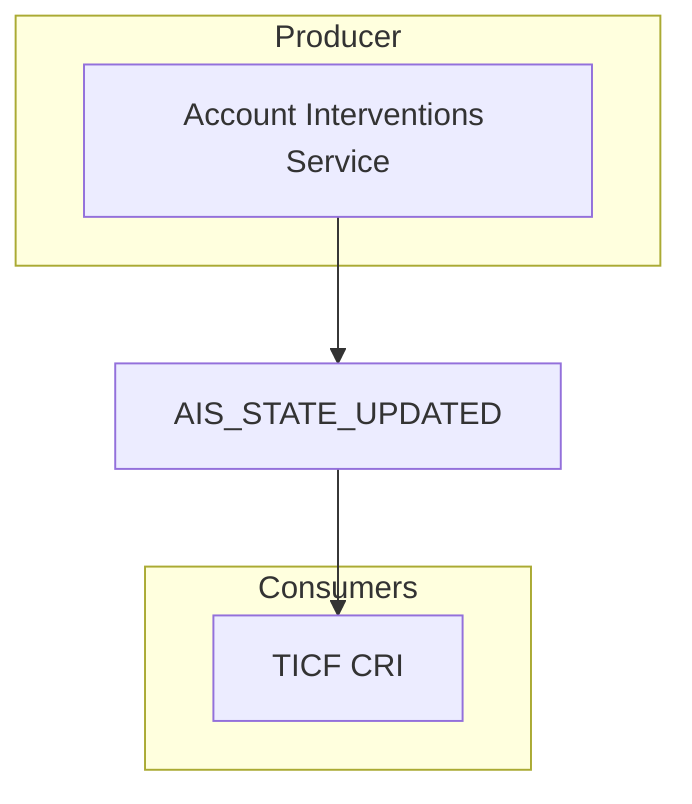

# AIS_STATE_UPDATED

[Original event](https://event-catalogue.internal.account.gov.uk/events/AIS_EVENT_TRANSITION_APPLIED/)

[JSON Schema](./schema.json)

[Example](./example.json)

## Questions

Do we need to include something like `allowable_interventions` or is this obvious or communicated another way?
