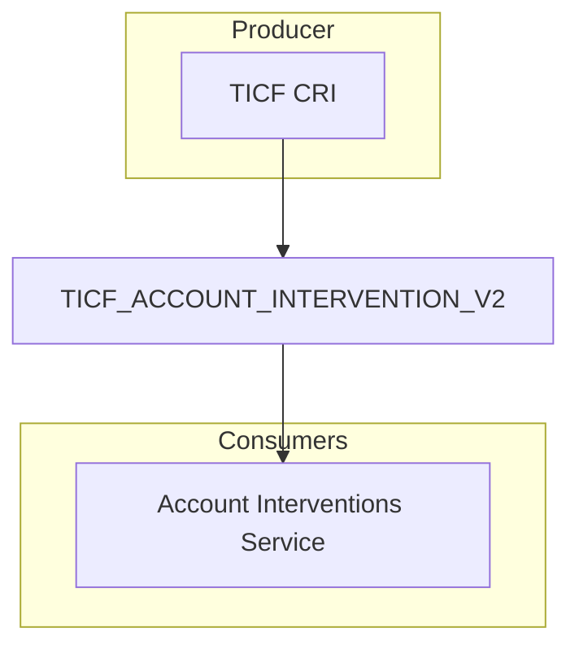

# TICF_ACCOUNT_INTERVENTION_V2

[Original Event](https://event-catalogue.internal.account.gov.uk/events/TICF_ACCOUNT_INTERVENTION/)

[JSON Schema](./schema.json)

[Example](./example.json)

## Notes

As `extensions.intervention` is not a required field on [TICF_ACCOUNT_INTERVENTION](https://event-catalogue.internal.account.gov.uk/events/TICF_ACCOUNT_INTERVENTION/) it would also be possible to create a new extension on the existing event.

Intervention names should match the enum from [intervention-name.ts](https://github.com/govuk-one-login/account-interventions-service/blob/main/src/data-types/intervention-name.ts).
