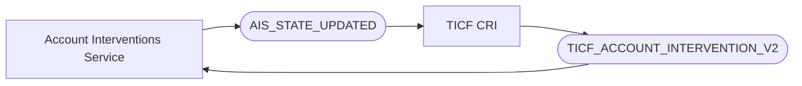

# Events V2

[TICF_ACCOUNT_INTERVENTION_V2](./TICF_ACCOUNT_INTERVENTION_V2/index.md)

[AIS_STATE_UPDATED](./AIS_STATE_UPDATED/index.md)

```mermaid
flowchart LR
  AIS[Account Interventions Service]
  TICF_CRI[TICF CRI]

  TICF_ACCOUNT_INTERVENTION_V2([TICF_ACCOUNT_INTERVENTION_V2])
  click TICF_ACCOUNT_INTERVENTION_V2 "./TICF_ACCOUNT_INTERVENTION_V2/index.md"
  AIS_STATE_UPDATED([AIS_STATE_UPDATED])
  click AIS_STATE_UPDATED "./AIS_STATE_UPDATED/index.md"

  TICF_CRI --> TICF_ACCOUNT_INTERVENTION_V2
  TICF_ACCOUNT_INTERVENTION_V2 --> AIS

  AIS --> AIS_STATE_UPDATED
  AIS_STATE_UPDATED --> TICF_CRI
```
